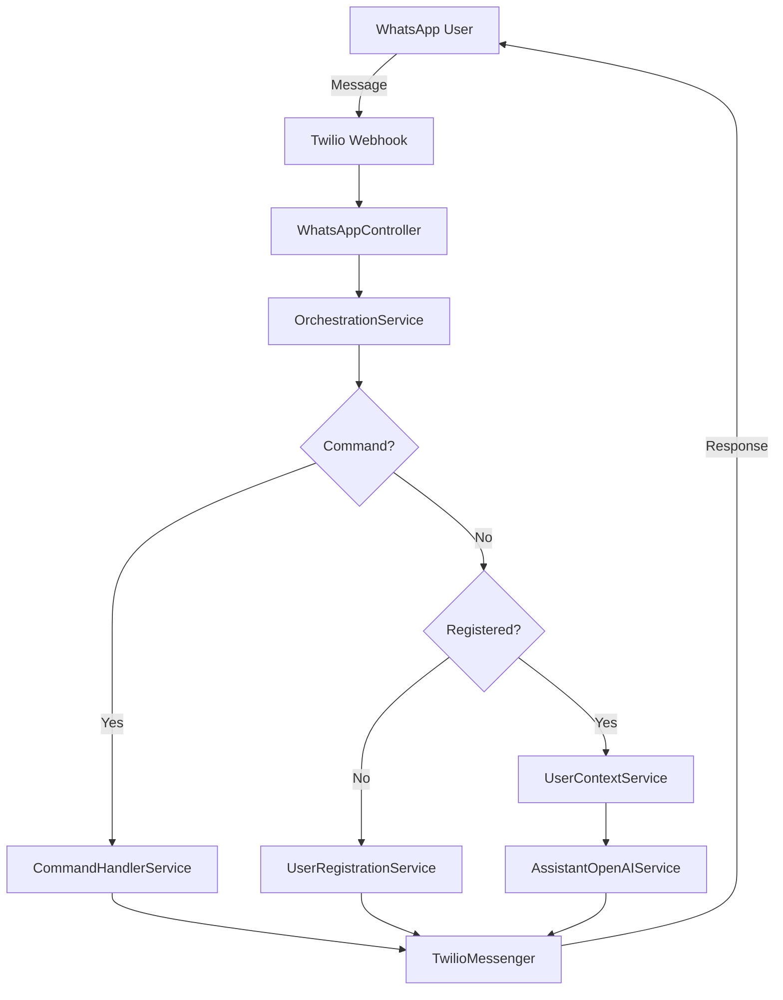

# WhatsApp AI Assistant Bot - Developer Guide

Complete developer documentation for building, extending, and maintaining the WhatsApp AI Assistant Bot.

## 📚 Table of Contents

- [Getting Started](#-getting-started)
- [Architecture Overview](#-architecture-overview)
- [Development Environment](#-development-environment)
- [Core Components](#-core-components)
- [Adding Features](#-adding-features)
- [Testing Guide](#-testing-guide)
- [Database Management](#-database-management)
- [API Documentation](#-api-documentation)
- [Best Practices](#-best-practices)
- [Troubleshooting](#-troubleshooting)

## 🚀 Getting Started

### Prerequisites

```bash
# Required Tools
.NET 8 SDK                    # https://dotnet.microsoft.com/download/dotnet/8.0
Visual Studio 2022+           # or VS Code with C# extension
Git                          # Version control
Docker Desktop               # For containerization
Azure CLI                    # For cloud deployment

# Accounts Needed
OpenAI Account               # API key and Assistant ID
Twilio Account               # WhatsApp Business API
Azure Subscription          # For production deployment
```

### Quick Setup

```bash
# 1. Clone repository
git clone https://github.com/your-username/WhatsAppAIAssistantBot.git
cd WhatsAppAIAssistantBot

# 2. Restore dependencies
dotnet restore

# 3. Setup configuration
cp src/WhatsAppAIAssistantBot.Api/appsettings.json src/WhatsAppAIAssistantBot.Api/appsettings.Development.json

# 4. Build solution
dotnet build

# 5. Run tests
dotnet test

# 6. Start development server
dotnet run --project src/WhatsAppAIAssistantBot.Api
```

### Configuration Setup

Create `appsettings.Development.json`:

```json
{
  "OpenAI": {
    "ApiKey": "sk-your-openai-api-key",
    "AssistantId": "asst_your-assistant-id"
  },
  "Twilio": {
    "AccountSid": "ACyour-twilio-account-sid",
    "AuthToken": "your-twilio-auth-token",
    "FromNumber": "whatsapp:+your-twilio-number"
  },
  "ConnectionStrings": {
    "DefaultConnection": "Data Source=whatsapp_bot.db"
  },
  "Logging": {
    "LogLevel": {
      "Default": "Information",
      "Microsoft.AspNetCore": "Warning"
    }
  }
}
```

## 🏗️ Architecture Overview

### Clean Architecture Layers

The solution follows Clean Architecture principles with clear separation of concerns:

```
┌─────────────────────────────────────────────────────────────┐
│                    Presentation Layer                        │
│  ┌─────────────────────────────────────────────────────────┐ │
│  │              WhatsAppAIAssistantBot.Api               │ │
│  │  • Controllers (WhatsApp, Health)                      │ │
│  │  • Middleware & Configuration                          │ │
│  │  • Swagger Documentation                               │ │
│  └─────────────────────────────────────────────────────────┘ │
└─────────────────────────────────────────────────────────────┘
┌─────────────────────────────────────────────────────────────┐
│                   Application Layer                         │
│  ┌─────────────────────────────────────────────────────────┐ │
│  │           WhatsAppAIAssistantBot.Application           │ │
│  │  • OrchestrationService                                │ │
│  │  • CommandHandlerService                               │ │
│  │  • UserRegistrationService                             │ │
│  │  • AssistantOpenAIService                              │ │
│  └─────────────────────────────────────────────────────────┘ │
└─────────────────────────────────────────────────────────────┘
┌─────────────────────────────────────────────────────────────┐
│                     Domain Layer                            │
│  ┌─────────────────────────────────────────────────────────┐ │
│  │             WhatsAppAIAssistantBot.Domain              │ │
│  │  • Entities (User)                                     │ │
│  │  • Service Interfaces                                  │ │
│  │  • Domain Models & Enums                               │ │
│  └─────────────────────────────────────────────────────────┘ │
└─────────────────────────────────────────────────────────────┘
┌─────────────────────────────────────────────────────────────┐
│                 Infrastructure Layer                        │
│  ┌─────────────────────────────────────────────────────────┐ │
│  │        WhatsAppAIAssistantBot.Infrastructure           │ │
│  │  • TwilioMessenger                                     │ │
│  │  • LocalizationService                                 │ │
│  │  • ApplicationDbContext                                │ │
│  │  • UserRepository                                      │ │
│  └─────────────────────────────────────────────────────────┘ │
└─────────────────────────────────────────────────────────────┘
```

### Data Flow Architecture



## 🛠️ Development Environment

### IDE Setup

#### Visual Studio 2022
```xml
<!-- .editorconfig -->
root = true

[*.cs]
dotnet_style_qualification_for_field = false
dotnet_style_qualification_for_property = false
csharp_prefer_braces = true
csharp_new_line_before_open_brace = all
```

#### VS Code Extensions
```json
{
  "recommendations": [
    "ms-dotnettools.csharp",
    "ms-dotnettools.vscode-dotnet-runtime",
    "humao.rest-client",
    "ms-vscode.vscode-json"
  ]
}
```

### Local Development Workflow

```bash
# 1. Start with clean build
dotnet clean
dotnet restore
dotnet build

# 2. Run database migrations
dotnet ef database update --project src/WhatsAppAIAssistantBot.Infrastructure --startup-project src/WhatsAppAIAssistantBot.Api

# 3. Start development server with hot reload
dotnet watch run --project src/WhatsAppAIAssistantBot.Api

# 4. In another terminal, run tests in watch mode
dotnet watch test
```

### Docker Development

```bash
# Build development image
docker build -f Dockerfile.dev -t whatsapp-bot-dev .

# Run with live reload
docker run -it --rm \
  -p 5001:5001 \
  -v $(pwd):/app \
  -e ASPNETCORE_ENVIRONMENT=Development \
  whatsapp-bot-dev
```

## 🔧 Core Components

### 1. OrchestrationService

The main orchestrator that coordinates the entire message processing workflow:

```csharp
public class OrchestrationService : IOrchestrationService
{
    public async Task HandleMessageAsync(string userId, string message)
    {
        // 1. Initialize user and thread
        var (user, threadId) = await GetOrCreateUserAsync(userId);
        
        // 2. Try to handle as command first
        if (await _commandHandlerService.HandleCommandAsync(user, message))
            return;
            
        // 3. Handle registration process for unregistered users
        if (!user.IsRegistered)
        {
            await _userRegistrationService.ProcessRegistrationAsync(user, message);
            return;
        }
        
        // 4. Handle regular conversation
        await HandleConversationAsync(user, threadId, message);
    }
}
```

### 2. CommandHandlerService

Processes bot commands like language switching and help:

```csharp
public class CommandHandlerService : ICommandHandlerService
{
    public async Task<bool> HandleCommandAsync(User user, string message)
    {
        // Language commands: /lang en, /idioma es
        if (await HandleLanguageCommandAsync(user, message))
            return true;
            
        // Help commands: /help, /ayuda
        if (await HandleHelpCommandAsync(user, message))
            return true;
            
        return false;
    }
}
```

### 3. UserRegistrationService

Manages the progressive user registration flow:

```csharp
public class UserRegistrationService : IUserRegistrationService
{
    public async Task<RegistrationResult> ProcessRegistrationAsync(User user, string message)
    {
        // Extract data using AI
        var extractionResult = await _userDataExtractionService.ExtractUserDataAsync(request);
        
        // Handle name collection
        if (string.IsNullOrEmpty(user.Name) && extractionResult.Name?.IsSuccessful == true)
        {
            // Save name and request email
        }
        
        // Handle email collection
        if (!string.IsNullOrEmpty(user.Name) && extractionResult.Email?.IsSuccessful == true)
        {
            // Complete registration
        }
    }
}
```

## ➕ Adding Features

### Adding New Bot Commands

1. **Add Command Handler**:
```csharp
// In CommandHandlerService.cs
private async Task<bool> HandleMyNewCommandAsync(User user, string message)
{
    var lowerMessage = message.ToLower().Trim();
    
    if (lowerMessage == "/mynewcommand")
    {
        var response = await _localizationService.GetLocalizedMessageAsync(
            "MyNewCommandResponse", user.LanguageCode);
        await _twilioMessenger.SendMessageAsync(user.PhoneNumber, response);
        return true;
    }
    
    return false;
}
```

2. **Add Localization Keys**:
```csharp
// In LocalizationKeys.cs
public const string MyNewCommandResponse = "my_new_command_response";
```

3. **Add Resource Strings**:
```json
// In Resources/en.json
{
  "my_new_command_response": "This is my new command response!"
}

// In Resources/es.json
{
  "my_new_command_response": "¡Esta es la respuesta de mi nuevo comando!"
}
```

4. **Add Unit Tests**:
```csharp
[Fact]
public async Task HandleCommandAsync_WithMyNewCommand_ShouldReturnTrue()
{
    // Arrange
    var command = "/mynewcommand";
    
    // Act
    var result = await _commandHandlerService.HandleCommandAsync(_testUser, command);
    
    // Assert
    Assert.True(result);
    _mockTwilioMessenger.Verify(x => x.SendMessageAsync(_testUser.PhoneNumber, 
        It.IsAny<string>()), Times.Once);
}
```

### Adding New Languages

1. **Update SupportedLanguage Enum**:
```csharp
public enum SupportedLanguage
{
    English,
    Spanish,
    French  // New language
}
```

2. **Add Extension Methods**:
```csharp
public static string ToCode(this SupportedLanguage language) => language switch
{
    SupportedLanguage.English => "en",
    SupportedLanguage.Spanish => "es",
    SupportedLanguage.French => "fr",  // New language
    _ => "es"
};
```

3. **Create Resource File**:
```json
// Create Resources/fr.json
{
  "welcome_message": "Bienvenue! Je suis votre assistant IA WhatsApp.",
  "request_name": "Veuillez me donner votre nom.",
  // ... all other keys
}
```

4. **Test Language Support**:
```bash
# Test language switching
curl -X POST http://localhost:5001/api/whatsapp \
  -H "Content-Type: application/x-www-form-urlencoded" \
  -d "From=whatsapp%3A%2B1234567890&Body=%2Flang%20fr"
```

### Adding Custom AI Skills

1. **Create Skill Class**:
```csharp
public class WeatherSkill
{
    [KernelFunction, Description("Get weather information for a location")]
    public async Task<string> GetWeatherAsync(
        [Description("The city name")] string city)
    {
        // Implementation
        return $"The weather in {city} is sunny, 25°C";
    }
}
```

2. **Register in SemanticKernelService**:
```csharp
public class SemanticKernelService
{
    public SemanticKernelService()
    {
        _kernel = Kernel.CreateBuilder()
            .AddOpenAIChatCompletion("gpt-4", apiKey)
            .Build();
            
        _kernel.ImportPluginFromType<TimeSkill>();
        _kernel.ImportPluginFromType<WeatherSkill>();  // New skill
    }
}
```

## 🧪 Testing Guide

### Test Structure

```
WhatsAppAIAssistantBot.Tests/
├── Unit/
│   ├── OrchestrationServiceTests.cs
│   ├── CommandHandlerServiceTests.cs
│   ├── UserRegistrationServiceTests.cs
│   └── TwilioMessengerTests.cs
├── Integration/
│   ├── WebhookIntegrationTests.cs
│   └── DatabaseIntegrationTests.cs
└── Helpers/
    ├── TestDataBuilder.cs
    └── MockFactory.cs
```

### Writing Unit Tests

```csharp
public class CommandHandlerServiceTests
{
    private readonly Mock<ILocalizationService> _mockLocalizationService;
    private readonly Mock<ITwilioMessenger> _mockTwilioMessenger;
    private readonly CommandHandlerService _commandHandlerService;
    
    public CommandHandlerServiceTests()
    {
        _mockLocalizationService = new Mock<ILocalizationService>();
        _mockTwilioMessenger = new Mock<ITwilioMessenger>();
        
        _commandHandlerService = new CommandHandlerService(
            _mockLocalizationService.Object,
            _mockTwilioMessenger.Object,
            Mock.Of<ILogger<CommandHandlerService>>());
    }
    
    [Theory]
    [InlineData("/help")]
    [InlineData("/ayuda")]
    public async Task HandleCommandAsync_WithHelpCommand_ShouldReturnTrue(string command)
    {
        // Arrange
        _mockLocalizationService.Setup(x => x.GetLocalizedMessageAsync(
            LocalizationKeys.HelpMessage, It.IsAny<string>()))
            .ReturnsAsync("Help message");
        
        // Act
        var result = await _commandHandlerService.HandleCommandAsync(_testUser, command);
        
        // Assert
        Assert.True(result);
        _mockTwilioMessenger.Verify(x => x.SendMessageAsync(
            _testUser.PhoneNumber, "Help message"), Times.Once);
    }
}
```

### Integration Testing

```csharp
public class WebhookIntegrationTests : IClassFixture<WebApplicationFactory<Program>>
{
    private readonly WebApplicationFactory<Program> _factory;
    
    public WebhookIntegrationTests(WebApplicationFactory<Program> factory)
    {
        _factory = factory;
    }
    
    [Fact]
    public async Task WhatsAppWebhook_WithValidMessage_ShouldReturnOk()
    {
        // Arrange
        var client = _factory.CreateClient();
        var formData = new FormUrlEncodedContent(new[]
        {
            new KeyValuePair<string, string>("From", "whatsapp:+1234567890"),
            new KeyValuePair<string, string>("Body", "Hello")
        });
        
        // Act
        var response = await client.PostAsync("/api/whatsapp", formData);
        
        // Assert
        Assert.Equal(HttpStatusCode.OK, response.StatusCode);
    }
}
```

### Test Data Builders

```csharp
public class TestDataBuilder
{
    public static User CreateTestUser(string phoneNumber = "whatsapp:+1234567890")
    {
        return new User
        {
            PhoneNumber = phoneNumber,
            Name = "Test User",
            Email = "test@example.com",
            LanguageCode = "en",
            ThreadId = "thread_123",
            CreatedAt = DateTime.UtcNow,
            UpdatedAt = DateTime.UtcNow
        };
    }
    
    public static TwilioWebhookModel CreateWebhookModel(string from, string body)
    {
        return new TwilioWebhookModel
        {
            From = from,
            Body = body,
            MessageSid = "SM123456789"
        };
    }
}
```

### Running Tests

```bash
# Run all tests
dotnet test

# Run tests with coverage
dotnet test --collect:"XPlat Code Coverage"

# Run specific test class
dotnet test --filter "ClassName=CommandHandlerServiceTests"

# Run tests by category
dotnet test --filter "Category=Integration"

# Run tests in watch mode
dotnet watch test
```

## 🗄️ Database Management

### Entity Framework Setup

The application uses Entity Framework Core with support for both SQLite (development) and SQL Server (production).

### Migration Commands

```bash
# Add new migration
dotnet ef migrations add AddNewFeature \
  --project src/WhatsAppAIAssistantBot.Infrastructure \
  --startup-project src/WhatsAppAIAssistantBot.Api

# Update database
dotnet ef database update \
  --project src/WhatsAppAIAssistantBot.Infrastructure \
  --startup-project src/WhatsAppAIAssistantBot.Api

# Remove last migration
dotnet ef migrations remove \
  --project src/WhatsAppAIAssistantBot.Infrastructure \
  --startup-project src/WhatsAppAIAssistantBot.Api

# Generate SQL script
dotnet ef migrations script \
  --project src/WhatsAppAIAssistantBot.Infrastructure \
  --startup-project src/WhatsAppAIAssistantBot.Api
```

### Adding New Entities

1. **Create Entity**:
```csharp
public class Conversation
{
    public int Id { get; set; }
    public string UserId { get; set; }
    public string Message { get; set; }
    public string Response { get; set; }
    public DateTime CreatedAt { get; set; }
    
    public User User { get; set; }
}
```

2. **Update DbContext**:
```csharp
public class ApplicationDbContext : DbContext
{
    public DbSet<User> Users { get; set; }
    public DbSet<Conversation> Conversations { get; set; }  // New entity
    
    protected override void OnModelCreating(ModelBuilder modelBuilder)
    {
        // Configure relationships
        modelBuilder.Entity<Conversation>()
            .HasOne(c => c.User)
            .WithMany()
            .HasForeignKey(c => c.UserId);
    }
}
```

3. **Create Migration**:
```bash
dotnet ef migrations add AddConversationEntity \
  --project src/WhatsAppAIAssistantBot.Infrastructure \
  --startup-project src/WhatsAppAIAssistantBot.Api
```

### Database Seeding

```csharp
public static class DatabaseSeeder
{
    public static async Task SeedAsync(ApplicationDbContext context)
    {
        if (!context.Users.Any())
        {
            var users = new[]
            {
                new User
                {
                    PhoneNumber = "whatsapp:+1234567890",
                    Name = "Test User",
                    Email = "test@example.com",
                    LanguageCode = "en"
                }
            };
            
            context.Users.AddRange(users);
            await context.SaveChangesAsync();
        }
    }
}
```

## 📖 API Documentation

### Swagger Configuration

```csharp
// In Program.cs
builder.Services.AddSwaggerGen(c =>
{
    c.SwaggerDoc("v1", new OpenApiInfo
    {
        Title = "WhatsApp AI Assistant Bot API",
        Version = "v1",
        Description = "Production-ready WhatsApp AI Assistant Bot API"
    });
    
    // Include XML comments
    var xmlFile = $"{Assembly.GetExecutingAssembly().GetName().Name}.xml";
    var xmlPath = Path.Combine(AppContext.BaseDirectory, xmlFile);
    c.IncludeXmlComments(xmlPath);
});
```

### API Endpoints

#### WhatsApp Webhook
```http
POST /api/whatsapp
Content-Type: application/x-www-form-urlencoded

From=whatsapp%3A%2B1234567890
&Body=Hello%20Bot
&MessageSid=SM123456789
```

#### Health Checks
```http
GET /api/health
Response: {
  "status": "healthy",
  "timestamp": "2024-01-01T12:00:00Z",
  "version": "1.0.0"
}

GET /api/health/ready
Response: {
  "status": "ready",
  "timestamp": "2024-01-01T12:00:00Z"
}
```

## 📋 Best Practices

### Code Style

```csharp
// Use explicit typing for complex types
Dictionary<string, List<User>> userGroups = new();

// Use var for simple assignments
var users = await _userRepository.GetAllAsync();

// Prefer async/await over Task.Result
var result = await ProcessMessageAsync(message);

// Use meaningful variable names
var unregisteredUsers = users.Where(u => !u.IsRegistered);
```

### Error Handling

```csharp
public async Task<T> HandleWithRetryAsync<T>(Func<Task<T>> operation)
{
    const int maxRetries = 3;
    
    for (int attempt = 1; attempt <= maxRetries; attempt++)
    {
        try
        {
            return await operation();
        }
        catch (Exception ex) when (attempt < maxRetries)
        {
            _logger.LogWarning(ex, "Operation failed on attempt {Attempt}", attempt);
            await Task.Delay(TimeSpan.FromSeconds(Math.Pow(2, attempt)));
        }
    }
    
    throw new InvalidOperationException($"Operation failed after {maxRetries} attempts");
}
```

### Logging

```csharp
public class OrchestrationService
{
    public async Task HandleMessageAsync(string userId, string message)
    {
        var correlationId = Guid.NewGuid().ToString("N")[..8];
        
        using var scope = _logger.BeginScope(new Dictionary<string, object>
        {
            ["CorrelationId"] = correlationId,
            ["UserId"] = userId,
            ["MessageLength"] = message?.Length ?? 0
        });
        
        _logger.LogInformation("Starting message processing for user {UserId}", userId);
        
        try
        {
            // Process message
            _logger.LogInformation("Message processing completed successfully");
        }
        catch (Exception ex)
        {
            _logger.LogError(ex, "Error processing message for user {UserId}", userId);
            throw;
        }
    }
}
```

### Configuration

```csharp
// Use strongly-typed configuration
public class OpenAIOptions
{
    public const string SectionName = "OpenAI";
    
    public string ApiKey { get; set; } = string.Empty;
    public string AssistantId { get; set; } = string.Empty;
}

// Register in DI
builder.Services.Configure<OpenAIOptions>(
    builder.Configuration.GetSection(OpenAIOptions.SectionName));
```

## 🔍 Troubleshooting

### Common Issues

#### 1. Database Connection Issues
```bash
# Check connection string
dotnet ef dbcontext info \
  --project src/WhatsAppAIAssistantBot.Infrastructure \
  --startup-project src/WhatsAppAIAssistantBot.Api

# Reset database
dotnet ef database drop \
  --project src/WhatsAppAIAssistantBot.Infrastructure \
  --startup-project src/WhatsAppAIAssistantBot.Api
```

#### 2. OpenAI API Issues
```csharp
// Add retry logic for OpenAI calls
public async Task<string> GetAssistantReplyWithRetryAsync(string threadId, string message)
{
    return await Policy
        .Handle<OpenAIException>()
        .WaitAndRetryAsync(
            retryCount: 3,
            sleepDurationProvider: retryAttempt => TimeSpan.FromSeconds(Math.Pow(2, retryAttempt)),
            onRetry: (outcome, timespan, retryCount, context) =>
            {
                _logger.LogWarning("OpenAI call failed, retry {RetryCount} in {Delay}ms", 
                    retryCount, timespan.TotalMilliseconds);
            })
        .ExecuteAsync(async () =>
        {
            return await _assistantClient.GetAssistantReplyAsync(threadId, message);
        });
}
```

#### 3. Twilio Webhook Issues
```bash
# Test webhook locally with ngrok
ngrok http 5001

# Test webhook endpoint
curl -X POST http://localhost:5001/api/whatsapp \
  -H "Content-Type: application/x-www-form-urlencoded" \
  -d "From=whatsapp%3A%2B1234567890&Body=test"
```

### Performance Optimization

#### 1. Database Optimization
```csharp
// Use async methods
var users = await _context.Users
    .Where(u => u.IsRegistered)
    .ToListAsync();

// Avoid N+1 queries
var usersWithThreads = await _context.Users
    .Include(u => u.Conversations)
    .ToListAsync();

// Use pagination for large datasets
var pagedUsers = await _context.Users
    .Skip(page * pageSize)
    .Take(pageSize)
    .ToListAsync();
```

#### 2. Memory Management
```csharp
// Dispose resources properly
public async Task ProcessLargeDatasetAsync()
{
    using var scope = _serviceProvider.CreateScope();
    var context = scope.ServiceProvider.GetRequiredService<ApplicationDbContext>();
    
    // Process data
}

// Use streaming for large responses
public async IAsyncEnumerable<User> GetUsersStreamAsync()
{
    await foreach (var user in _context.Users.AsAsyncEnumerable())
    {
        yield return user;
    }
}
```

### Debugging Tips

#### 1. Structured Logging
```csharp
// Use structured logging with Serilog
Log.Information("User {UserId} registered with name {Name} and email {Email}", 
    user.PhoneNumber, user.Name, user.Email);
```

#### 2. Health Checks
```csharp
// Add custom health checks
public class DatabaseHealthCheck : IHealthCheck
{
    public async Task<HealthCheckResult> CheckHealthAsync(HealthCheckContext context, 
        CancellationToken cancellationToken = default)
    {
        try
        {
            await _context.Database.CanConnectAsync(cancellationToken);
            return HealthCheckResult.Healthy();
        }
        catch (Exception ex)
        {
            return HealthCheckResult.Unhealthy("Database connection failed", ex);
        }
    }
}
```

#### 3. Application Insights
```csharp
// Track custom events
_telemetryClient.TrackEvent("UserRegistered", new Dictionary<string, string>
{
    ["UserId"] = user.PhoneNumber,
    ["Language"] = user.LanguageCode
});

// Track custom metrics
_telemetryClient.TrackMetric("MessageProcessingTime", processingTime);
```

---

## 📚 Additional Resources

- **[.NET 8 Documentation](https://docs.microsoft.com/en-us/dotnet/)**
- **[Entity Framework Core Documentation](https://docs.microsoft.com/en-us/ef/core/)**
- **[xUnit Testing Documentation](https://xunit.net/)**
- **[Moq Documentation](https://github.com/moq/moq4)**
- **[OpenAI API Documentation](https://platform.openai.com/docs/)**
- **[Twilio API Documentation](https://www.twilio.com/docs/)**

---

**Happy coding! 🚀** This guide should help you build amazing features for the WhatsApp AI Assistant Bot.